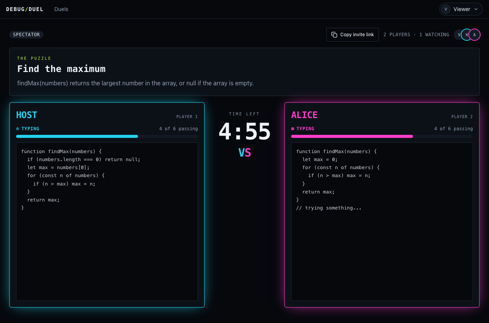

# DEBUG/DUEL

A live 1v1 coding battle. Two developers get the same buggy JavaScript function and race to fix it while everyone else watches. The first to pass all the hidden tests wins, and an AI commentator compares the two fixes afterwards.

**Live:** https://debug-duel.app.space
**Build notes (decisions, bugs found and fixed, what I verified):** [BUILD_LOG.md](./BUILD_LOG.md)



## Try a duel solo (two accounts)

1. Open the live site and click **Start a duel**, then sign in (GitHub or Google). Create a duel and click **Join as a player**.
2. Open the duel link in a **private/incognito window** and sign in with a **second account**. Click **Join as a player**.
3. Back in the first window, click **Start the round**. Fix the bug and press **Run tests**. First to pass every test wins.
4. Optional: open the link in a third window as a spectator. Spectators see both editors live. Each player sees the other's live status and score, but not their code until the round ends.

## What it does

- Host creates a duel and shares a link. The first two people to join are the players; everyone else is a spectator.
- Same buggy function, a shared server-side countdown (1, 3, 5 or 10 minutes), hidden tests, five hand-written puzzles.
- Live editors, presence (who is watching), and per-player status and progress bars.
- Winner screen for everyone at the same moment, both solutions revealed, then AI commentary.

## DeepSpace features used

- **Auth**: sign-in and a verified identity on every server action.
- **Records + real-time sync**: duels, editors, scores and results synced over WebSockets.
- **Permissions (RBAC)**: enforced in the Durable Object. Players can only edit their own code, spectators are read-only, and the opponent's code is never sent to a player during the round.
- **Presence**: who is in the room, plus typing and running-tests status.
- **Server actions**: join, start, submit, finish and commentary run on the server, which owns the clock and the winner.
- **Cron**: a scheduled sweep closes expired rounds even if every browser has left.
- **AI**: post-round commentary through DeepSpace's AI proxy (no API key in the repo).

Left out on purpose: the Anthropic code-execution sandbox (slow, costs credits, prompt-injection risk for a rapid run-tests loop), AI puzzle generation, payments, file uploads, voice/video and leaderboards.

## Main tradeoff

Tests run **in the player's browser** (a Web Worker with a 3-second timeout), so a determined player could fake a pass. The server still validates and timestamps every submission, owns the clock and decides the winner. Next step: re-run the winning submission's code server-side before confirming the win.

## Develop

```bash
npm install
npx deepspace dev start      # local app on http://localhost:5173
npx deepspace test run e2e   # Playwright (needs test accounts: see BUILD_LOG.md)
npx vitest run               # unit tests
```

Secrets live in `deepspace secrets`, never in the repo.
